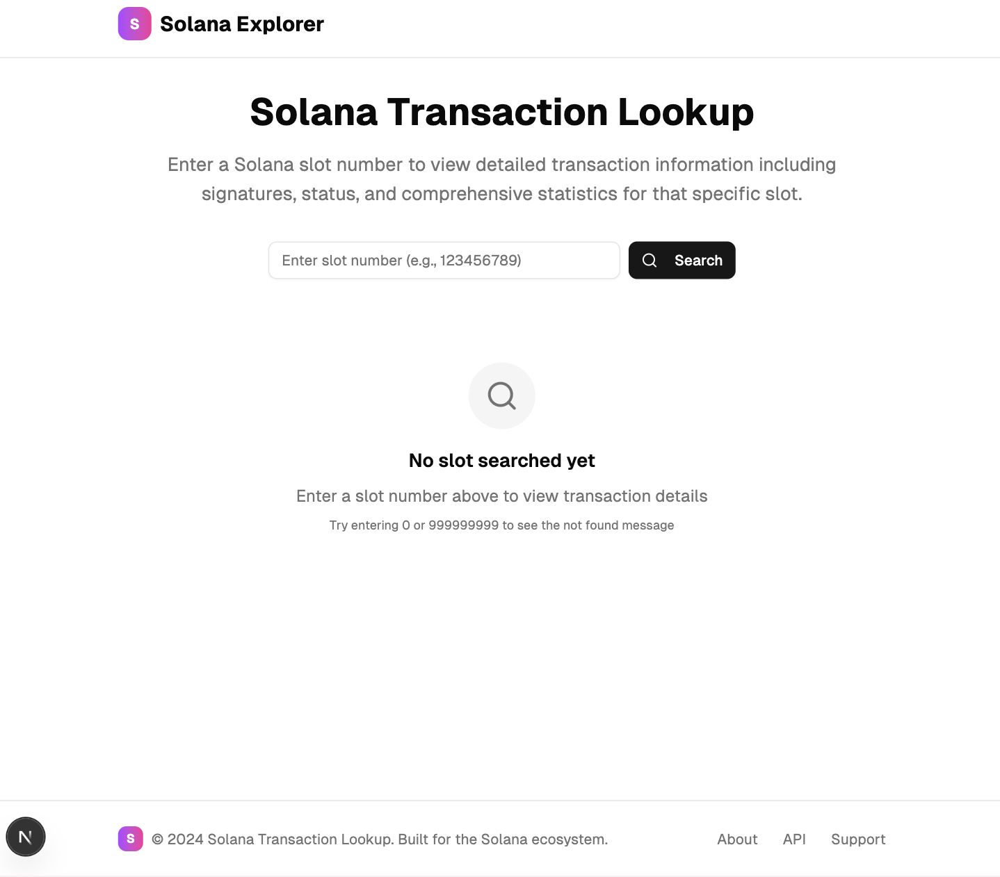

# NestJs + NextJs + Turborepo


<p align="center">
  
</p>

## TODO

### Web
- [x] App header
- [x] App footer
- [x] App body
- [x] App title
- [x] App description
- [x] Solana transaction container
- [x] Solana transaction list
- [x] Solana transaction item
- [x] Solana transaction details
- [x] Wire up with backend api

### API
- [x] Solana get transaction by slot number (/data/solana/:slot-number)

### Utils
- [x] LRU cache over API

### Packages
- [x] Solana API client


## Run
### Prerequisites
- Node.js >= 22
- ENV:
  - `SOLANA_RPC_URL` for api

### Install dependencies
```bash
pnpm install
pnpm run build
````

### Run the app

```bash
cd apps/web
PORT=3000 pnpm run dev
```

### Run the API

```bash
cd apps/api
SOLANA_RPC_URL=[...rpc-here] PORT=3001 pnpm run start:dev
```
